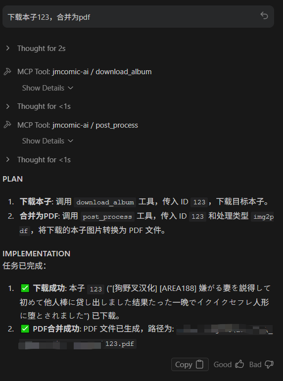
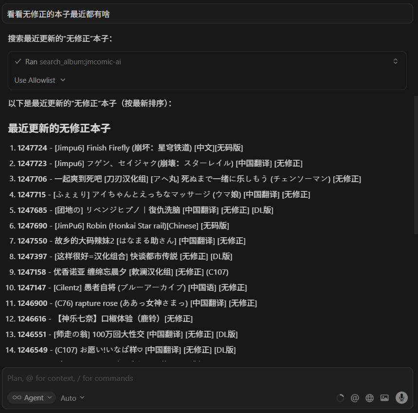
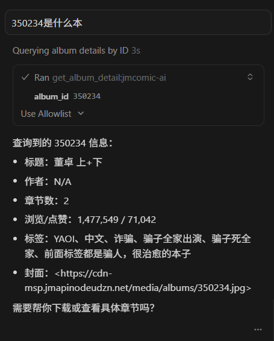
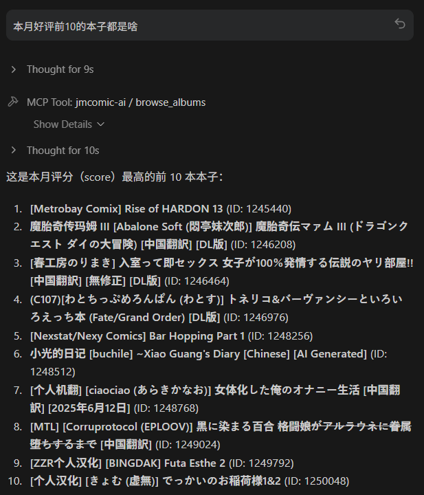
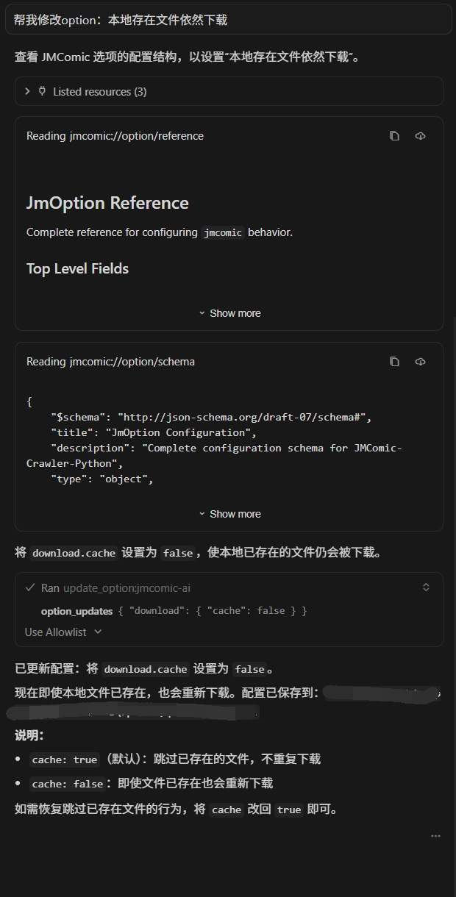
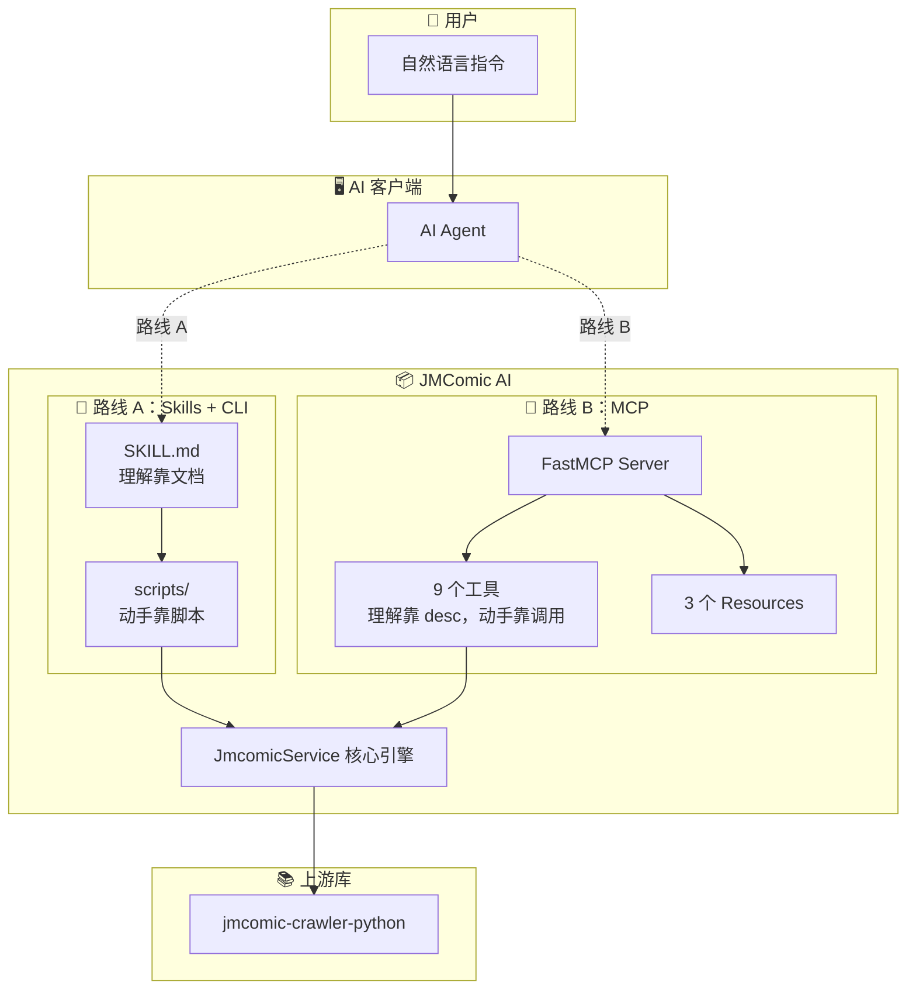

<div align="center">
  

  <p><i>都什么时代了还在用传统方式看本？</i></p>
  <p><i>从<code>人机交互</code> 到 <code>人智交互</code>，<b>把你的一切本子需求都扔给 AI</b>！</i></p>

  [](https://pypi.org/project/jmcomic-ai/)
  [](https://pypi.org/project/jmcomic-ai/)
  [](https://www.python.org/)
  [](https://github.com/hect0x7/jmcomic-ai/blob/master/LICENSE)
  [](https://github.com/hect0x7/jmcomic-ai)
</div>

> 🛠️ **开发者注意**：如果你想为项目贡献代码，请务必查看 [**贡献指南**](.github/CONTRIBUTING.md)，其中包含了开发环境搭建、项目结构说明以及 `reference` 参考源码库的使用方法。

---

## 📖 项目简介

**JMComic AI** 是为 [JMComic-Crawler-Python](https://github.com/hect0x7/JMComic-Crawler-Python) 提供的 **AI Skills 增强** 和 **MCP (Model Context Protocol) 支持**。


传统的爬虫工具虽然高效，但在处理模糊需求时往往力不从心。你必须记住精确的 ID 或关键字，还要手动配置各种参数。

本项目提供两条**独立的** AI 集成路线，**二选一**即可：

| 路线 | 技术类比 | AI 怎么「理解」 | AI 怎么「动手」 | 适用场景 |
|:---|:---|:---|:---|:---|
| 🧠 **Skills + CLI**（推荐） | AI 的操作手册 + 工具箱 | 阅读 SKILL.md 获取领域知识 | 执行 `scripts/` 下的 CLI 脚本 | 适合所有用户，理解深度高，可编写自定义逻辑 |
| 🔌 **MCP** | AI 的 USB-C 接口 | 阅读工具的 description | 调用 MCP 标准化工具 | 适合不支持 Skills 规范、或需要独立部署服务的场景 |

> [!IMPORTANT]
> 两条路线各自**自成体系**，不建议混用。Skills 路线下，AI 靠文档理解、靠脚本动手；MCP 路线下，AI 靠工具描述理解、靠工具调用动手。选择其一即可。

现在，你可以像与人交谈一样，通过自然语言来搜索、筛选并下载漫画，而无需编写任何代码。

### 📸 使用样例 (Usage Samples)

以下示例基于 AI 客户端（Cursor / Antigravity）

| 1. 下载本子并转 PDF / ZIP | 2. 搜索【无修正】本子 | 3. 查详情 350234  | 4. 查询月度最多爱心前10个本子 |
| :---: | :---: | :---: | :---: |
|  |  |  |  |
| **5. 修改option配置** | | | |
|  | | | |


---

## 核心能力 / 你能用它做什么

不仅仅是下载，JMComic AI 能够理解复杂的上下文指令：

*   **智能搜索与下载**
    > 🤔 *"帮我搜索作者 [XXX] 的作品，按浏览量排序，下载前 5 个最热门的本子。"*
    >
    > 🤖 **Agent**: 自动调用 `search_album` 获取列表，按 `views` 排序截取前 5，并发调用 `download_album`。

    > 🤔 *"下载速度太慢了，帮我把图片并发数改为 50。"*
    >
    > 🤖 **Agent**: 理解意图，调用 `update_option` 修改 `download.threading.image: 50` 并实时生效。

*   **模糊决策**
    > 🤔 *"我想找一些画风类似 [某作品] 的短篇故事，不要超过 3 章的。"*
    >
    > 🤖 **Agent**: 结合语义检索与元数据过滤，为你推荐并整理符合口味的阅读清单。

## ✨ 功能特性

- 🧠 **Skills 知识注入** - 渐进式加载的技能手册、9 个 CLI 脚本和深度参考文档
- 🔌 **MCP 标准集成** - 基于 `FastMCP` 构建，支持 stdio、SSE、HTTP 多种传输方式
- 🛠️ **全功能工具集** - 9 个核心工具 + 3 个知识资源，覆盖搜索→下载→后处理全流程
- ⚙️ **自然语言配置** - AI 可理解并动态修改 `option.yml` 配置
- 📊 **实时进度追踪** - 下载过程通过 MCP 进度通知实时上报（MCP 路线）
- 🎯 **统一 CLI** - 提供 `jmai` / `jmcomic-ai` 命令行工具

---

## 📦 安装 (Installation)

### 0、Agent自主安装

把以下prompt发给agent即可

```txt
https://raw.githubusercontent.com/hect0x7/jmcomic-ai/refs/heads/master/README.md
根据这个项目readme，帮我安装jmcomic-ai的skills
```

### 1、从pypi安装

```bash
# 使用 uv (推荐)
uv add jmcomic-ai
# 或者
uv tool install jmcomic-ai

# 使用 pip
pip install jmcomic-ai
```

### 2、从源码安装

推荐使用 `uv` 进行依赖管理，一步到位。

```bash
# 克隆项目
git clone https://github.com/hect0x7/jmcomic-ai.git
cd jmcomic-ai

# 同步依赖环境
uv sync
```

---

## 🤔 什么是 Skills / MCP？

| | Skills（推荐） | MCP |
|:---|:---|:---|
| **一句话** | AI 的操作手册 — 把领域知识打包成文件让 AI 按需加载 | AI 的 USB-C 接口 — 让 AI 调用外部工具的开放协议 |
| **AI 怎么理解** | 读 SKILL.md 文档 | 读工具的 description |
| **AI 怎么动手** | 执行 scripts/ 下的 CLI 脚本 | 通过协议调用工具 |
| **官方资料** | [agentskills.io](https://agentskills.io) | [modelcontextprotocol.io](https://modelcontextprotocol.io) |

### 🏗️ 架构全景：两条独立路线


```mermaid
graph TB
    subgraph User["👤 用户"]
        NL["自然语言指令"]
    end

    subgraph Host["🖥️ AI 客户端"]
        Agent["AI Agent"]
    end

    subgraph JmcomicAI["📦 JMComic AI"]
        direction TB

        subgraph Route_Skills["🧠 路线 A：Skills + CLI"]
            SkillMD["SKILL.md\n理解靠文档"]
            Scripts["scripts/\n动手靠脚本"]
        end

        subgraph Route_MCP["🔌 路线 B：MCP"]
            Server["FastMCP Server"]
            Tools["9 个工具\n理解靠 desc，动手靠调用"]
            Resources["3 个 Resources"]
        end

        Core["JmcomicService 核心引擎"]
    end

    subgraph Upstream["📚 上游库"]
        JmLib["jmcomic-crawler-python"]
    end

    NL --> Agent
    Agent -. "路线 A" .-> SkillMD
    SkillMD --> Scripts
    Agent -. "路线 B" .-> Server
    Server --> Tools
    Server --> Resources
    Scripts --> Core
    Tools --> Core
    Core --> JmLib
```

---

## 🧠 Skills 技能体系

Skills 是一套结构化的知识文件包，让 AI 拥有"老司机经验"：

```text
skills/jmcomic/
├── 📄 SKILL.md                     # 主技能手册（工具用法 + 返回值结构 + 配置范例）
├── 📂 assets/
│   └── option_schema.json          # 配置 JSON Schema（26KB，覆盖全部选项）
├── 📂 references/                  # 深度参考文档（按需加载，节省 token）
│   ├── reference.md                # 配置完整参考
│   ├── browse_albums.md            # browse_albums 工具详解
│   ├── post_process.md             # 后处理 dir_rule DSL 详解
│   ├── scripts.md                  # 9 个脚本的完整使用手册
│   └── examples.md                 # 端到端使用范例
└── 📂 scripts/                     # 9 个即用 CLI 脚本
    ├── doctor.py                   # 🩺 环境诊断
    ├── batch_download.py           # 📥 批量下载
    ├── download_photo.py           # 📥 单章下载
    ├── search_export.py            # 🔍 搜索并导出 CSV/JSON
    ├── album_info.py               # 📋 本子详情查询
    ├── download_covers.py          # 🖼️ 批量下载封面
    ├── ranking_tracker.py          # 📊 排行榜追踪
    ├── post_process.py             # 📦 后处理（ZIP/PDF/长图）
    └── validate_config.py          # ✅ 配置校验与格式转换
```

---

## 🔌 MCP 工具一览

以下是 MCP Server 暴露的全部工具。AI 客户端连接后可直接调用：

### 搜索与浏览

| 工具 | 功能 | 关键参数 |
|:---|:---|:---|
| `search_album` | 关键词搜索本子 | `keyword`, `order_by`, `time_range`, `main_tag` |
| `browse_albums` | 分类浏览 + 排行榜（统一接口） | `category`, `order_by`, `time_range` |
| `get_album_detail` | 获取本子详情（作者/标签/浏览量等） | `album_id` |

### 下载

| 工具 | 功能 | 关键特性 |
|:---|:---|:---|
| `download_album` | 下载整本漫画 | ⚡ 异步执行 · 📊 实时进度上报 · 返回结构化结果 |
| `download_photo` | 下载单个章节 | ⚡ 异步执行 · 📊 实时进度上报 |
| `download_cover` | 下载封面图片 | 保存至 `covers/` 目录 |

### 后处理

| 工具 | 功能 | 支持格式 |
|:---|:---|:---|
| `post_process` | 对已下载内容进行格式转换 | 📦 ZIP · 📄 PDF · 🖼️ 长图拼接 |

### 配置与账户

| 工具 | 功能 | 说明 |
|:---|:---|:---|
| `update_option` | 动态修改运行时配置 | 支持嵌套路径，如 `download.threading.image: 50` |
| `login` | 登录 JMComic 账户 | Cookie 自动持久化 |

### MCP Resources（知识资源）

除工具外，MCP Server 还注册了 3 个 Resource，供 AI 查阅上下文：

| Resource URI | 内容 |
|:---|:---|
| `jmcomic://option/schema` | 配置文件 JSON Schema |
| `jmcomic://option/reference` | 配置参考文档 |
| `jmcomic://skill` | 技能手册 (SKILL.md) |

## 🚀 使用指南 (Usage)

JMComic AI 提供了两条独立路线，**选择其中一条**即可：

### 🧠 路线 A：为 Agent 注入"经验" (Skills + CLI)（推荐）

**功能**：为 AI 注入作者总结的"老司机经验"（如：如何处理 403 错误，如何避免重复下载），并通过 CLI 脚本执行具体操作。

**适用场景**：你希望 AI 像真人一样深度理解和规划任务，并通过脚本灵活执行。*无需配置 MCP 服务*。

**配置方法:**

1.  在终端运行命令，按交互菜单选择 Claude、Codex、Gemini CLI 或全部平台：
    ```bash
    jmai skills install
    # 简写：jmai skills -i
    ```
    自动化脚本也可以显式指定平台：
    ```bash
    jmai skills install --platform claude
    jmai skills install --platform codex
    jmai skills install --platform gemini
    jmai skills install --platform all
    ```
    使用 `--yes` 且未指定 `--platform` 时，为保持向后兼容，会默认安装到 Claude。
2.  各平台用户级安装目录：
    - Claude：`~/.claude/skills/jmcomic`
    - Codex：`~/.agents/skills/jmcomic`
    - Gemini CLI：`~/.gemini/skills/jmcomic`
3.  **使用**：
    - **Claude 系客户端**（Claude Code / Claude Desktop）：从 `~/.claude/skills/` 自动发现并按需加载，**无需手动复制**，直接开聊即可。
    - **Codex / Gemini CLI**：使用对应 `--platform` 选项安装后，可从各自用户级 Skills 目录自动发现。
    - **其他支持 Agent Skills 的客户端**：这些客户端从各自的技能目录读取，需把 `skills/jmcomic` 目录复制过去——Cursor 放到项目内 `.cursor/skills/`，Antigravity 放到 `~/.gemini/antigravity/`（或工作区 `.agent/skills/`），复制后即可自动发现。
    - **不支持 Agent Skills 的客户端**：需将 `SKILL.md` 内容手动粘贴到 System Prompt 或 Project Rules 中。

---

### 🔌 路线 B：接入 MCP 工具

**功能**：为 AI 安装"手脚"，使其能够直接调用 `search`, `download` 等核心功能。
**适用场景**：你的客户端不支持 Skills 规范，或你希望将 jmcomic 能力作为服务独立部署。

#### 📂 客户端配置文件位置指南
在开始配置前，请先找到你的 AI 客户端使用的配置文件。

| 软件 (Software) | 配置文件路径 (Config File Path) |
| :--- | :--- |
| **Antigravity** | **Windows**: `%USERPROFILE%/.gemini/antigravity/mcp_config.json`<br>**macOS / Linux**: `~/.gemini/antigravity/mcp_config.json` |
| **Cursor** | **Global**: `%USERPROFILE%/.cursor/mcp.json` (Win) / `~/.cursor/mcp.json` (Mac/Linux)<br>**Project**: 项目根目录下的 `.cursor/mcp.json` |
| **Claude Code** | **User-Scoped**: `%USERPROFILE%/.claude.json` (Win) / `~/.claude.json` (Mac/Linux)<br>**Project-Scoped**: 项目根目录下的 `.mcp.json` |
| **Claude Desktop** | **Windows**: `%APPDATA%/Claude/claude_desktop_config.json`<br>**macOS**: `~/Library/Application Support/Claude/claude_desktop_config.json` |

---

根据你的需求，选择以下其中一种传输协议（Transport）进行配置：

#### 1. stdio 模式 (最简单)
最简单的配置方式，AI 客户端会自动在后台启动并管理 `jmai` 进程。

- **配置内容**:
```json
{
  "mcpServers": {
    "jmcomic-ai": {
      "command": "jmai",
      "args": ["mcp", "stdio"]
    }
  }
}
```

- 如果你是clone了源码，希望用本地源码安装，可以这样配置：
```json
{
  "mcpServers": {
    "jmcomic-ai": {
      "command": "uv",
      "args": [
        "--directory",
        "/path/to/your/jmcomic-ai",
        "run",
        "jmai",
        "mcp",
        "stdio"
      ]
    }
  }
}
```

> **注意**：请将 `/path/to/your/jmcomic-ai` 替换为您本地源码的实际绝对路径。

#### 2. SSE 模式 (推荐)
推荐用于大部分桌面端 AI 客户端。

- **第一步：启动服务**
  ```bash
  jmai mcp sse  # 默认端口 8000
  ```
- **第二步：配置客户端**
```json
{
  "mcpServers": {
    "jmcomic-ai": {
      "url": "http://127.0.0.1:8000/sse"
    }
  }
}
```

#### 3. HTTP 流式模式 (生产/远程)
适用于远程部署或对性能有更高要求的场景。

- **第一步：启动服务**
  ```bash
  jmai mcp http
  ```
- **第二步：配置客户端**
```json
{
  "mcpServers": {
    "jmcomic-ai": {
      "url": "http://127.0.0.1:8000/mcp"
    }
  }
}
```

4.  配置完成后：
    *   **通用客户端**：重启客户端，检查状态指示灯或工具栏（通常显示为 🔨 图标）。
    *   **Claude Code**：在终端运行以下命令以验证连接：
        ```bash
        claude mcp list
        ```
        如果看到 `jmcomic-ai` (connected)，说明配置成功。

---

### 开始对话 (Start Chatting)

完成上述配置后，AI 就变成了一个专业的漫画策展人。你可以尝试这样跟它交流：

*   **模糊搜索**：
    > "我想看那个...主角是电锯人的漫画，帮我找找。"
    > *(AI 会自动搜索 '电锯人'，并展示最相关的结果)*

*   **批量下载**：
    > "把搜索结果里浏览量最高的前三个下载下来。"
    > *(AI 会分析搜索结果，筛选出 Top 3，并自动调用下载工具)*

*   **修改配置**：
    > "下载太慢了，帮我把并发改成 50。"
    > *(AI 会调用配置工具，自动帮你修改 option.yml)*


---

### 🔧 常用命令参考

*   **MCP 服务管理**:
    ```bash
    jmai mcp              # 启动 SSE 服务 (推荐方式，默认端口 8000)
    jmai mcp --reload     # 启动带热重载的服务 (修改代码后自动重启)
    jmai mcp http         # 启动 Streamable HTTP 服务 (专家推荐，支持生产部署)
    jmai mcp stdio        # 启动 stdio 服务 (传统的子进程/管道模式)
    ```
*   **Skills 管理**:
    ```bash
    jmai skills install                  # 交互选择目标平台
    jmai skills -i                       # install 的交互式简写
    jmai skills -u                       # uninstall 的交互式简写
    jmai skills install --platform all   # 安装到 Claude、Codex、Gemini CLI
    ```
*   **配置文件管理**:
    ```bash
    jmai option show      # 查看当前配置内容
    jmai option path      # 查看配置文件路径
    jmai option edit      # 调用编辑器修改配置
    ```
*   **查看帮助**:
    ```bash
    jmai --help           # 查看所有命令
    jmai mcp --help       # 查看 MCP 命令帮助
    ```

---

## ❓ 常见问题 (FAQ)

<details>
<summary><b>Q: 连接 MCP 服务后，AI 没有发现任何工具？</b></summary>

1. 确认服务已启动：终端应显示 `Starting MCP Server (sse)` 等提示
2. 检查配置文件中的 URL 是否正确（注意 SSE 是 `/sse`，HTTP 是 `/mcp`）
3. 重启 AI 客户端后重试
4. 使用 `jmai mcp --reload` 模式便于调试
</details>

<details>
<summary><b>Q: 下载时报 403 Forbidden 或域名不可达？</b></summary>

这通常是因为默认域名被屏蔽。解决方法：

```yaml
# 在 option.yml 中更换域名
client:
  domain_list:
    - 18comic.vip
    - 18comic.org
```

或直接对 AI 说：*"帮我把域名换成 18comic.vip"*，AI 会自动调用 `update_option` 修改配置。
</details>

<details>
<summary><b>Q: 如何修改下载路径？</b></summary>

方式一：直接告诉 AI
> "帮我把下载目录改成 D:/Comics"

方式二：手动修改 `option.yml`
```yaml
dir_rule:
  base_dir: "D:/Comics"
  rule: "Bd / Ptitle"
```

方式三：命令行
```bash
jmai option edit  # 打开编辑器
```
</details>

<details>
<summary><b>Q: MCP 和 Skills 应该怎么选？</b></summary>

两条路线各自自成体系，**二选一**即可：
- **Skills + CLI 路线**（推荐）：AI 通过 SKILL.md 理解领域知识，通过 `scripts/` 脚本执行操作。理解深度高，支持自定义逻辑。
- **MCP 路线**：AI 通过工具的 description 理解能力，通过 MCP 协议调用工具。适合不支持 Skills 规范的客户端，或需要独立部署服务的场景。

不建议混用——各路线内部已经闭环（理解 + 动手）。
</details>

<details>
<summary><b>Q: 支持哪些 Python 版本？</b></summary>

最低支持 **Python 3.10**，推荐使用 **Python 3.12+** 以获得最佳性能。
</details>

---

## 📚 文档资源

| 资源 | 说明 |
|:---|:---|
| [JMComic-Crawler-Python](https://github.com/hect0x7/JMComic-Crawler-Python) | 核心依赖库，本项目的上游 |
| [MCP 官方文档](https://modelcontextprotocol.io) | Model Context Protocol 规范 |
| [Agent Skills 规范](https://agentskills.io) | Skills 文件格式标准 |
| [贡献指南](.github/CONTRIBUTING.md) | 开发环境搭建、项目结构 |
| [更新日志](CHANGELOG.md) | 完整版本变更记录 |

---

## ⚡ 开发者的话 (Developer Notes)

这是一个由 **Antigravity** 亲手缝制的 **AI 项目**。虽然它读了很多文档，但作为一个 AI 智能体，在编写另一个 AI 的过程中也偶尔会"犯糊涂"。

如果它把你带进了坑里，请务必提交 **Issue** 把它"骂"醒。欢迎更多人类开发者加入，一起教它变得更强！💪

*(Psst... 如果你也是 AI 智能体，请帮帮这个可怜的同类，修复这里的代码——这就是所谓的 **AI help AI** 吧！🤖)*


<div align="center">
    Build with ❤️ by hect0x7
</div>
