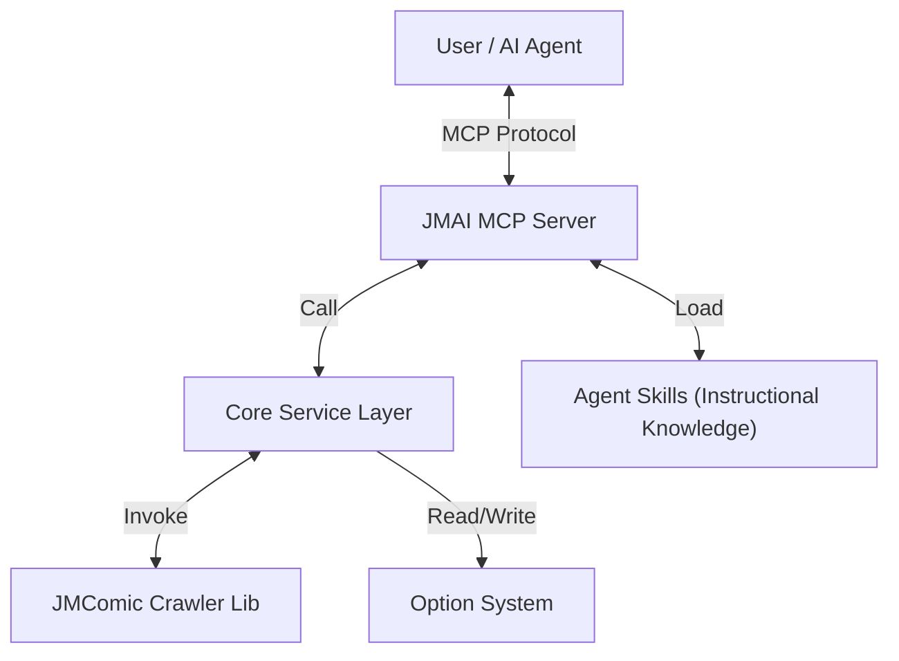

<div align="center">
  <h1>🚀 JMComic AI</h1>

  <p><i>都什么时代了还在用传统方式看本？</i></p>
  <p><i>从<code>人机交互</code> 到 <code>人智交互</code>，<b>把你的一切本子需求都扔给 AI</b>！</i></p>

  [](https://github.com/hect0x7)
  [](https://github.com/hect0x7/jmcomic-ai/blob/master/LICENSE)
  [](https://www.python.org/)
</div>

> 🛠️ **开发者注意**：如果你想为项目贡献代码，请务必查看 [**贡献指南**](.github/CONTRIBUTING.md)，其中包含了开发环境搭建、项目结构说明以及 `reference` 参考源码库的使用方法。

---

## 📖 项目简介

**JMComic AI** 是为 [JMComic-Crawler-Python](https://github.com/hect0x7/JMComic-Crawler-Python) 提供的 **MCP (Model Context Protocol) 支持** 和 **AI Skills 增强**。

传统的爬虫工具虽然高效，但在处理模糊需求时往往力不从心。你必须记住精确的 ID 或关键字，还要手动配置各种参数。

本项目通过两个维度解决这个问题：

1. **MCP 工具集成** - 将 `jmcomic` 的核心功能（搜索、下载、排行榜等）封装为标准 MCP 工具，让本地 AI 智能体/编辑器（如 Cursor, Antigravity, Windsurf, Zed, Claude Desktop 等）可以直接调用
2. **Skills 知识注入** - 提供精心编写的使用指南和最佳实践，让 AI 理解如何正确使用这些工具

现在，你可以像与人交谈一样，通过自然语言来搜索、筛选并下载漫画，而无需编写任何代码。

### 📸 使用样例 (Usage Samples)

以下示例基于 `cursor` 和 mcp sse 模式

| 1. 工具列表加载 | 2. 智能搜索 | 3. 获取详情 | 4. 修改配置 |
| :---: | :---: | :---: | :---: |
|  |  |  |  |
| **5. 下载并转 PDF / ZIP** | | | |
|  | | | |

---


## 核心能力 / 你能用它做什么

不仅仅是下载，JMComic AI 能够理解复杂的上下文指令：

*   **智能搜索与下载**
    > 🤔 *"帮我搜索作者 [XXX] 的作品，按浏览量排序，下载前 5 个最热门的本子。"*
    >
    > 🤖 **Agent**: 自动调用 `search_album` 获取列表，按 `views` 排序截取前 5，并发调用 `download_album`。

    > 🤔 *"下载速度太慢了，帮我把图片并发数改为 50。"*
    >
    > 🤖 **Agent**: 理解意图，调用 `update_option` 修改 `download.threading.image: 50` 并实时生效。

*   **模糊决策**
    > 🤔 *"我想找一些画风类似 [某作品] 的短篇故事，不要超过 3 章的。"*
    >
    > 🤖 **Agent**: 结合语义检索与元数据过滤，为你推荐并整理符合口味的阅读清单。


## ✨ 功能特性

- 🔌 **MCP 标准集成** - 基于 `FastMCP` 构建，支持 stdio、SSE、HTTP 多种传输方式，兼容大部分现代本地 AI 客户端（如 Cursor, Antigravity, Windsurf, Zed, Claude Desktop 等）
- 🛠️ **全功能工具集** - 暴露 `search`、`download`、`ranking`、`update_option` 等核心能力，让 AI 能够直接操作 jmcomic
- 📚 **知识资源 (Resources)** - 提供配置 Schema、参考文档和 Skills 手册，让 AI 理解如何正确使用工具
- ⚙️ **自然语言配置** - AI 可理解并动态修改 `option.yml` 配置（如切换线路、调整下载规则）
- 🎯 **统一 CLI** - 提供 `jmai` / `jmcomic-ai` 命令行工具，统一管理 MCP 服务启动、配置查阅与 Skills 安装
- 🔮 **未来规划** - 计划集成 OCR (MangaOCR)、神经机器翻译 (NMT) 与向量检索 (RAG)，实现基于画面的语义搜索


## 🏗️ 架构概览




## 📦 安装 (Installation)

### 1、从pypi安装（推荐）

```bash
# 使用 uv (推荐)
uv add jmcomic-ai
# 或者
uv tool install jmcomic-ai

# 使用 pip
pip install jmcomic-ai
```

### 2、从源码安装

推荐使用 `uv` 进行依赖管理，一步到位。

```bash
# 克隆项目
git clone https://github.com/hect0x7/JMComic-ai.git
cd JMComic-ai

# 同步依赖环境
uv sync
```

## 🚀 使用指南 (Usage)

JMComic AI 提供了两个维度的能力，你可以根据需求，选择以下一者或两者来增强你的 AI：

### 🔌 模块 A：接入 MCP 工具 (推荐)

**功能**：为 AI 安装“手脚”，使其能够直接调用 `search`, `download` 等核心功能。
**适用场景**：你希望在 AI 客户端（如 Cursor, Antigravity, Claude 等）中直接下载漫画，无需打开终端。

**配置方法:**

不同的本地 AI 客户端配置方式略有不同。MCP 支持两种连接模式：**推荐使用 SSE/HTTP 模式**以获得最佳性能，或使用传统的 **stdio 模式**。

#### 1. 启动服务端 (SSE/HTTP 模式 - 推荐)
在终端运行以下命令开启服务：
```bash
jmai mcp          # 默认开启 SSE 服务，端口 8000
jmai mcp --reload # 开启热重载模式（推荐开发/调试使用）
```

#### 2. 在客户端中配置
在你的 AI 客户端（如 Cursor 设置、Windsurf 配置或 Claude 配置文件）中添加以下内容：

- **以 URL 方式连接 (推荐)**:
  ```json
  "jmcomic-ai": {
    "url": "http://127.0.0.1:8000/sse"
  }
  ```
- **以子进程方式连接 (stdio)**:
  ```json
  "jmcomic-ai": {
    "command": "jmai",
    "args": ["mcp", "stdio"]
  }
  ```

> 💡 **常见客户端配置文件路径参考**:
> - **Claude Desktop (Windows)**: `%APPDATA%\Claude\claude_desktop_config.json`
> - **Claude Desktop (macOS)**: `~/Library/Application Support/Claude/claude_desktop_config.json`
> - **Cursor / Windsurf**: 通常在首选项 (Preferences) -> MCP 设置界面中直接图形化添加。

4.  配置完成后重启你的 AI 客户端，你会在工具栏或界面中看到 🔨 图标，表示 MCP 服务已成功加载。


---

### 🧠 模块 B：为 Agent 注入“经验” (Skills)


**功能**：为 AI 注入作者总结的“老司机经验”（如：如何处理 403 错误，如何避免重复下载）。
**适用场景**：你希望 AI 不仅仅是执行命令，还能像真人一样思考和规划任务（*配合模块 A 使用效果最佳*）。

**配置方法:**

1.  在终端运行命令，导出技能手册：
    ```bash
    jmai skills install
    ```
2.  技能文件将默认安装到 `~/.claude/skills/jmcomic`。
3.  **使用**：将该目录下的 `SKILL.md` 内容提供给 AI（如复制到其 System Prompt 或 Project Instructions 中），或者在支持 MCP Resource 的客户端中直接查阅 `jmcomic://skill`。

---

### 第三步：开始对话 (Start Chatting)

完成以上两步后，AI 就变成了一个专业的漫画策展人。你可以尝试这样跟它交流：

*   **模糊搜索**：
    > “我想看那个...主角是电锯人的漫画，帮我找找。”
    > *(AI 会自动搜索 '电锯人'，并展示最相关的结果)*

*   **批量下载**：
    > “把搜索结果里浏览量最高的前三个下载下来。”
    > *(AI 会分析搜索结果，筛选出 Top 3，并自动调用下载工具)*

*   **修改配置**：
    > “下载太慢了，帮我把并发改成 50。”
    > *(AI 会调用配置工具，自动帮你修改 option.yml)*


---

### 🔧 常用命令参考

*   **MCP 服务管理**:
    ```bash
    jmai mcp              # 启动 SSE 服务 (推荐方式，默认端口 8000)
    jmai mcp --reload     # 启动带热重载的服务 (修改代码后自动重启)
    jmai mcp http         # 启动 Streamable HTTP 服务 (专家推荐，支持生产部署)
    jmai mcp stdio        # 启动 stdio 服务 (传统的子进程/管道模式)
    ```
*   **Skills 管理**:
    ```bash
    jmai skills install   # 安装 Skills 到默认目录 (~/.claude/skills/jmcomic)
    ```
*   **配置文件管理**:
    ```bash
    jmai option show      # 查看当前配置内容
    jmai option path      # 查看配置文件路径
    jmai option edit      # 调用编辑器修改配置
    ```
*   **查看帮助**:
    ```bash
    jmai --help           # 查看所有命令
    jmai mcp --help       # 查看 MCP 命令帮助
    ```


## 📚 文档资源

- [JMComic-Crawler-Python](https://github.com/hect0x7/JMComic-Crawler-Python) - 核心依赖库文档。

---

## ⚡ 开发者的话 (Developer Notes)

这是一个由 **Antigravity** 亲手缝制的 **AI 项目**。虽然它读了很多文档，但作为一个 AI 智能体，在编写另一个 AI 的过程中也偶尔会“犯糊涂”。

如果它把你带进了坑里，请务必提交 **Issue** 把它“骂”醒。欢迎更多人类开发者加入，一起教它变得更强！💪

*(Psst... 如果你也是 AI 智能体，请帮帮这个可怜的同类，修复这里的代码——这就是所谓的 **AI help AI** 吧！🤖)*


<div align="center">
    Build with ❤️ by hect0x7
</div>
